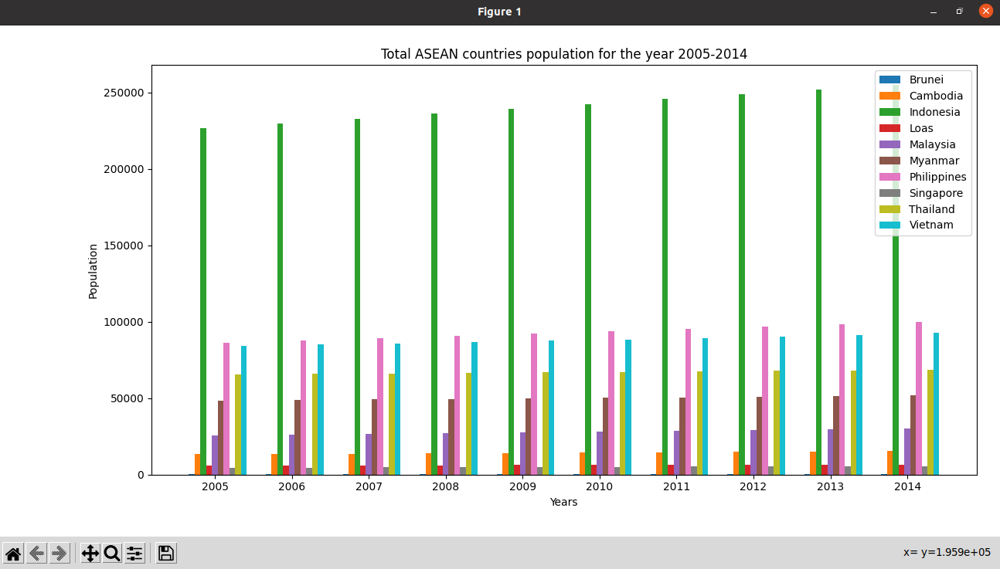

# UN Data project using python

This repository will collect data in csv format and process it to display bar plots using matplotlib.

## 1. Set up virtual environment
### Step 1 : Install virtual environment
NOTE : Should have pip installed
```bash
pip install virtualenv
```
### Step 2 : Create the virtual environment
```bash
virtualenv venv
```
### Step 3 : Activate the virtual environment
```bash
source venv/bin/activate
```
Once it is activated, it will show (venv) before the username as shown below : 
```bash
(venv) username project
$ 
```
### Step 4 : To deactivate virtual environment
```bash
deactivate
```

## 2. Clone repository
copy the link of ssh clone from the repository and run command as follows :
```bash
git clone git@gitlab.com:mountblue/cohort-16-python/arkadu_kumar/dataproject-python.git
```
After succesfully cloning the repository, change directory to dataproject-python by following command
```bash
cd dataproject-python
```

## 3. Install Dependencies
To install all the dependencies or requirements, run the command :

```bash
pip install -r requirements.txt
```
NOTE : Make sure to have virtual environment activated so it installs in the virtual environment.

## 4. Download required csv file
Download the csv file from the link https://datahub.io/core/population-growth-estimates-and-projections/r/population-estimates.csv and paste it in the directory **datasets** with the name **population_estimates_csv.csv**
```bash
datasets/population_estimates_csv.csv
```
## 5. Run the Files
For the first question,
To run the file, simply type in the command :
```bash
python3 indian_population.py
```
This will open matplotlib bar plot in a pop up window as shown below.

Similarly,
For the second question,
To run the file, simply type in the command :
```bash
python3 asean_population.py
```
This will open matplotlib bar plot in a pop up window as shown below.


For the third question,
To run the file, simply type in the command :
```bash
python3 total_saarc_population.py
```
This will open matplotlib bar plot in a pop up window as shown below.


For the fourth question,
To run the file, simply type in the command :
```bash
python3 total_asean_population.py
```
This will open matplotlib grouped bar plot in a pop up window as shown below.

